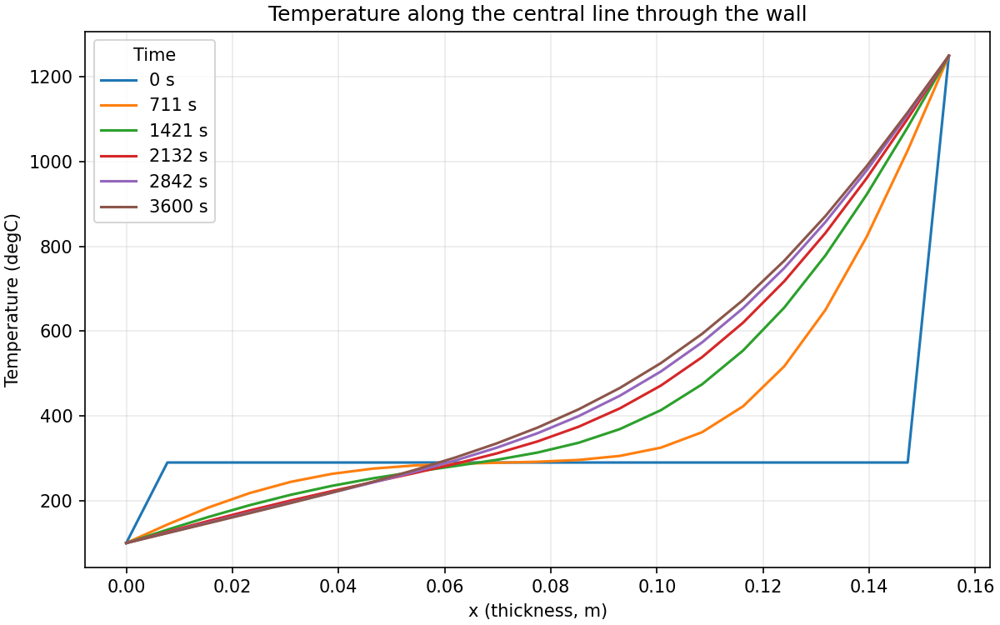
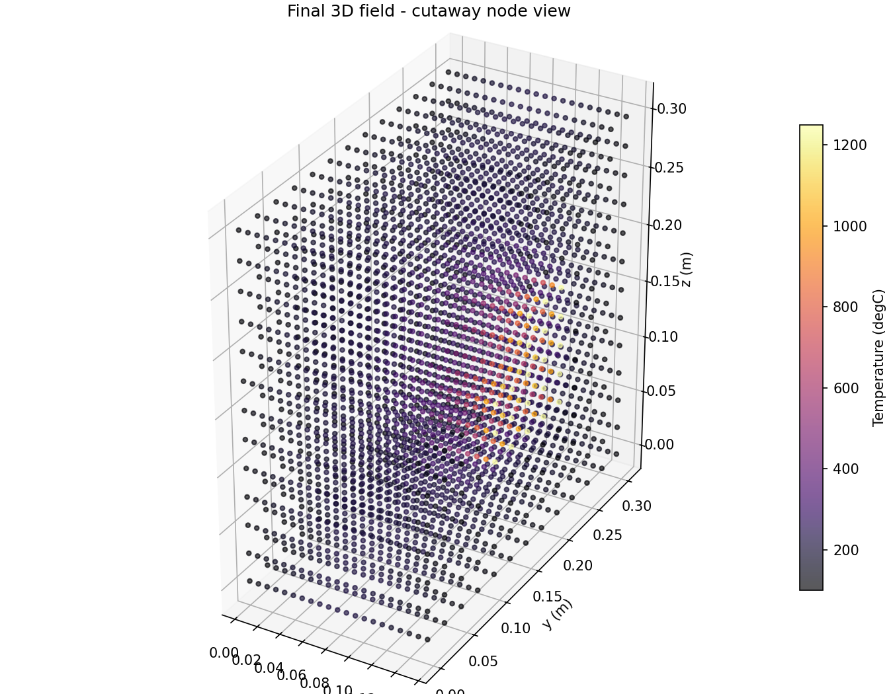
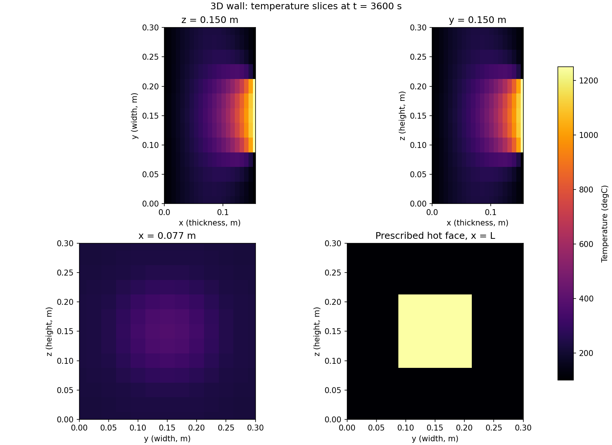

# 3D Transient Heat Conduction

A Python simulation of transient heat conduction through a rectangular furnace wall using an explicit finite-difference method.

## Project background and objective

This project extends an earlier academic model I developed in 1D Fortran. The original model was later reimplemented in Python and extended to study transient heat conduction in three spatial dimensions.

The 3D extension makes it possible to represent non-uniform thermal boundary conditions and lateral heat spreading that cannot be captured by a purely one-dimensional model.

The original model described conduction through the wall thickness. The extension adds width and height, with a localised hot patch that drives lateral heat spreading. It is an educational solid-conduction model, not CFD or a full industrial furnace model.

## Physical model

| Parameter | Value |
| --- | --- |
| Thickness, x | 0.155 m |
| Width, y; height, z | 0.30 m each |
| Thermal conductivity, k | 0.45 W/(m·K) |
| Density, ρ | 900 kg/m³ |
| Specific heat capacity, Cp | 1050 J/(kg·K) |
| Initial interior temperature | 290 °C |
| Simulation duration | 3600 s |
| Grid nodes | 21 × 13 × 13 |

Width and height are assumed dimensions for the 3D extension. All temperatures are treated as degrees Celsius; the initial value of 290 °C represents an already warm wall, not room temperature.

### Assumptions and boundary conditions

The wall is a homogeneous, isotropic solid with constant properties, no internal heat generation, and no phase change.

- **Left face, x = 0:** prescribed temperature of 100 °C.
- **Right face, x = L:** a centred rectangular patch at 1250 °C; the surrounding face remains at 100 °C.
- **Patch dimensions:** 40% of the width and 40% of the height, corresponding to a nominal 0.12 × 0.12 m patch. Grid nodes are selected by their coordinates.
- **Four lateral faces:** insulated, with zero normal temperature gradient.
- The prescribed end-face temperatures apply from the start and take priority at shared edges.

The patch creates gradients in y and z as well as x, producing a genuinely 3D temperature field. Equal width and height and a centred square patch explain the symmetry of the two central longitudinal slices. With uniform end-face temperatures and a uniform initial condition, the insulated lateral faces instead allow the model to reduce to a 1D solution.

**Convection, radiation, and multilayer materials are not currently implemented.** Prescribed surface temperatures represent idealised thermal boundary conditions rather than a calculation of heat exchange with furnace gases.

## Governing equation

For constant material properties and no internal heat source:

```math
\frac{\partial T}{\partial t}
=
\alpha
\left(
\frac{\partial^2 T}{\partial x^2}
+
\frac{\partial^2 T}{\partial y^2}
+
\frac{\partial^2 T}{\partial z^2}
\right)
```

Thermal diffusivity is:

```math
\alpha=\frac{k}{\rho C_p}
```

Here, k is thermal conductivity, ρ is density, and Cp is specific heat capacity. For the selected material, α = 4.761905 × 10⁻⁷ m²/s. Temperature differences in °C and K are equivalent in this equation.

## Numerical method and process

The solver uses forward Euler time integration and centred second-order spatial differences on a uniform Cartesian grid.

1. Define geometry, material properties, temperatures, and simulation duration.
2. Build the grid and compute spatial increments and thermal diffusivity.
3. Select a stable time step and adjust it to reach the requested final time exactly.
4. Initialise the temperature field and impose the end-face temperatures.
5. Update temperatures using the previous time level in all three directions. Reflected ghost nodes impose insulation on the lateral faces.
6. Store selected snapshots, generate three figures, and export the final field.

The explicit stability condition is:

```math
M_x+M_y+M_z\leq0.5
```

where:

```math
M_x=\frac{\alpha\Delta t}{\Delta x^2},\qquad
M_y=\frac{\alpha\Delta t}{\Delta y^2},\qquad
M_z=\frac{\alpha\Delta t}{\Delta z^2}
```

The code uses 90% of the maximum stable time step before adjusting the number of steps. Stability prevents unstable numerical growth; it does not by itself establish solution accuracy.

## Verification

The script includes a `self_test()` routine with the following checks, executed successfully for this version:

| Check | Method and result |
| --- | --- |
| Analytical 3D transient | Compare against an exact solution on a unit cube with α = 1 at t = 0.05. Maximum errors: 0.071398 and 0.018260 °C. |
| Grid refinement | Increase from 8 to 16 intervals per direction (9³ to 17³ nodes), with the stable time step refined accordingly. Maximum error decreases by about 3.91×. |
| Equivalent 1D solution | Uniform end-face temperatures produce agreement with an independent 1D explicit calculation using the same time step, within 10⁻⁹ °C. |
| Steady-state preservation | An initially linear temperature profile between uniform-temperature end faces remains unchanged within 10⁻⁹ °C. |
| Additional checks | Stability criterion, prescribed end-face temperatures, and temperature bounds pass for the analytical benchmark. |

The exact transient benchmark is:

```math
T(x,y,z,t)=100+100x+10\sin(\pi x)\cos(\pi y)\cos(\pi z)e^{-3\pi^2t}
```

It satisfies fixed temperatures on the x faces and insulation on the y and z faces. The refinement result is consistent with second-order convergence for this smooth benchmark when Δt scales with the square of grid spacing.

These checks verify numerical implementation, not agreement with experiments. A separate grid-convergence study of the localised hot-patch case remains to be completed. The steady-state check verifies preservation of a known solution; it does not prove the default run has reached steady state.

## Example simulation results

```text
Grid: 21 x 13 x 13 nodes
alpha = 4.761905e-07 m²/s | dt = 47.368421 s
Mx, My, Mz = [0.37554865 0.03609023 0.03609023]
sum = 0.447729 <= 0.5
Number of time steps: 76
Center temperature: 372.411 °C
```

After one hour, the centre at (0.0775, 0.15, 0.15) m reaches approximately 372.411 °C. Heat spreads inward from the hot patch, while regions near the prescribed 100 °C surfaces cool from their initial temperature.

### Temperature evolution along the centreline



Temperature profiles along x at the centre of the wall's width and height, from the initial state to 3600 s. The curves show the competing effects of heating near the patch and cooling near the opposite face.

### Final 3D cutaway temperature field



Coloured grid nodes show the final temperature field. An octant is hidden only for visualisation; the computational wall remains solid.

### Final temperature slices



Three central sections reveal heat spreading through the wall; the fourth panel shows the prescribed hot-patch boundary. The figures are the original simulation outputs supplied with this project.

### Numerical output

[`final_temperature.csv`](final_temperature.csv) contains 3549 grid-node records with columns:

```text
x_m,y_m,z_m,T_degC
```

Coordinates are in metres and temperature is in °C. The file can be inspected in a spreadsheet or reused in numerical analysis. Its coordinates and temperatures were checked against the supplied solver; temperature differences are below 5 × 10⁻⁹ °C, consistent with CSV rounding.

## Tools and running the project

The project uses Python, NumPy for numerical calculations, and Matplotlib for visualisation. `argparse` and `pathlib` are included in the Python standard library.

From the repository directory:

```bash
python -m pip install -r requirements.txt
python furnace_heat_3d.py
```

Run the included verification checks:

```bash
python furnace_heat_3d.py --test
```

Generate outputs without opening plot windows:

```bash
python furnace_heat_3d.py --no-show
```

The script writes outputs to `results_3d/` beside the Python file. It also generates `temperature_snapshots.npz` locally; this archive is ignored by Git and is not included in the repository. The committed PNGs in `images/` and the root CSV preserve the example run.

## Limitations and possible research extensions

This simplified model has no experimental validation and uses constant material properties over a wide temperature range. The coarse grid represents the patch through selected nodes, so its edge resolution can influence results. The default case needs its own spatial and temporal refinement study before quantitative engineering use.

The present model provides a verified conduction-only baseline. Further development could investigate convective and radiative boundary conditions, multilayer walls, temperature-dependent material properties, heat-flux and energy-balance analysis, and alternative time-integration schemes. These extensions would increase physical realism and provide a basis for studying thermal-performance and insulation-design questions.
